<div align="center">

# SIC — Security Intelligence Center

### AI-Powered MCP Cybersecurity Automation Platform

[](https://www.python.org/)
[](LICENSE)
[](https://github.com/DevCraftXCoder/sic)
[](https://github.com/DevCraftXCoder/sic)
[](https://github.com/DevCraftXCoder/sic)
[](https://github.com/DevCraftXCoder/sic)
[](https://github.com/DevCraftXCoder/sic)

**Offensive security automation framework — 150+ tools, 12+ autonomous agents, full MCP integration. Built for red teams, bug bounty hunters, CTF players, and security researchers.**

[Architecture](#architecture-overview) | [Installation](#installation) | [Features](#features) | [AI Agents](#ai-agents) | [Admin Panel](#admin-panel-integration) | [API Reference](#api-reference)

</div>

---

## Architecture Overview

SIC v6.0 features a multi-agent architecture with autonomous AI agents, intelligent decision-making, and vulnerability intelligence.

```mermaid
%%{init: {"themeVariables": {
  "primaryColor": "#b71c1c",
  "secondaryColor": "#ff5252",
  "tertiaryColor": "#ff8a80",
  "background": "#2d0000",
  "edgeLabelBackground":"#b71c1c",
  "fontFamily": "monospace",
  "fontSize": "16px",
  "fontColor": "#fffde7",
  "nodeTextColor": "#fffde7"
}}}%%
graph TD
    A[AI Agent - Claude/GPT/Copilot] -->|MCP Protocol| B[SIC MCP Server v6.0]

    B --> C[Intelligent Decision Engine]
    B --> D[12+ Autonomous AI Agents]
    B --> E[Modern Visual Engine]

    C --> F[Tool Selection AI]
    C --> G[Parameter Optimization]
    C --> H[Attack Chain Discovery]

    D --> I[BugBounty Agent]
    D --> J[CTF Solver Agent]
    D --> K[CVE Intelligence Agent]
    D --> L[Exploit Generator Agent]

    E --> M[Real-time Dashboards]
    E --> N[Progress Visualization]
    E --> O[Vulnerability Cards]

    B --> P[150+ Security Tools]
    P --> Q[Network Tools - 25+]
    P --> R[Web App Tools - 40+]
    P --> S[Cloud Tools - 20+]
    P --> T[Binary Tools - 25+]
    P --> U[CTF Tools - 20+]
    P --> V[OSINT Tools - 20+]

    B --> W[Advanced Process Management]
    W --> X[Smart Caching]
    W --> Y[Resource Optimization]
    W --> Z[Error Recovery]

    style A fill:#b71c1c,stroke:#ff5252,stroke-width:3px,color:#fffde7
    style B fill:#ff5252,stroke:#b71c1c,stroke-width:4px,color:#fffde7
    style C fill:#ff8a80,stroke:#b71c1c,stroke-width:2px,color:#fffde7
    style D fill:#ff8a80,stroke:#b71c1c,stroke-width:2px,color:#fffde7
    style E fill:#ff8a80,stroke:#b71c1c,stroke-width:2px,color:#fffde7
```



### How It Works

1. **AI client** (Claude, GPT, Copilot) sends commands via MCP protocol
2. **Decision engine** selects optimal tools and parameters
3. **Security tools** execute scans, exploits, and analysis
4. **Results** are formatted and returned through MCP with visual output

---

## Installation

### Quick Setup

```bash
git clone https://github.com/DevCraftXCoder/sic.git
cd sic
pip install -r requirements.txt
```

### Supported AI Clients

| Client | Status | Integration |
|--------|--------|-------------|
| Claude Desktop | Full support | MCP config |
| Cursor | Full support | MCP config |
| VS Code Copilot | Full support | Extension settings |
| Windsurf | Full support | MCP config |
| Any MCP client | Full support | Standard MCP |

### Install Security Tools

SIC automatically manages tool installation. On first run it checks for and installs required tools:

- **Network**: nmap, masscan, rustscan, netcat, tcpdump
- **Web**: nikto, sqlmap, wfuzz, gobuster, dirb, feroxbuster, httpx
- **Recon**: subfinder, amass, assetfinder, waybackurls, gau
- **Exploit**: metasploit, searchsploit, hydra, john, hashcat
- **Cloud**: awscli, gcloud, az-cli, terraform, scout-suite
- **Binary**: gdb, radare2, ghidra, binwalk, checksec
- **OSINT**: theHarvester, shodan, maltego, spiderfoot, recon-ng

### Start the Server

```bash
# Standard start
python sic_launcher.py

# With debug logging
python sic_launcher.py --debug

# Custom port
python sic_launcher.py --port 5001
```

Default: `http://127.0.0.1:5000`

### Verify Installation

```bash
curl http://127.0.0.1:5000/health
```

Returns tool status, category stats, uptime, and telemetry.

---

## AI Client Integration

### Claude Desktop / Cursor

Add to your MCP config (`claude_desktop_config.json` or `.cursor/mcp.json`):

```json
{
  "mcpServers": {
    "sic": {
      "command": "python",
      "args": ["/path/to/sic/sic_mcp.py"],
      "env": {}
    }
  }
}
```

### VS Code Copilot

Add to your VS Code MCP settings:

```json
{
  "mcp.servers": {
    "sic": {
      "command": "python",
      "args": ["/path/to/sic/sic_mcp.py"]
    }
  }
}
```

---

## Features

### Security Tools Arsenal

<details>
<summary><strong>Network Security (25+ tools)</strong></summary>

| Tool | Purpose |
|------|---------|
| nmap | Port scanning, service detection, OS fingerprinting |
| masscan | High-speed port scanning |
| rustscan | Fast port scanner with nmap integration |
| netcat | Network utility for reading/writing connections |
| tcpdump | Packet capture and analysis |
| wireshark-cli | Deep packet inspection |
| arp-scan | Layer 2 network discovery |
| ping sweep | Host discovery |
| traceroute | Network path analysis |
| DNS tools | Zone transfer, subdomain enumeration |

</details>

<details>
<summary><strong>Web Application Security (40+ tools)</strong></summary>

| Tool | Purpose |
|------|---------|
| sqlmap | Automated SQL injection |
| nikto | Web server scanner |
| wfuzz | Web fuzzer |
| gobuster | Directory/file brute-forcing |
| feroxbuster | Fast content discovery |
| httpx | HTTP probing and analysis |
| nuclei | Template-based vulnerability scanner |
| XSS detection | Cross-site scripting analysis |
| SSRF scanner | Server-side request forgery detection |
| CORS checker | Cross-origin misconfiguration detection |

</details>

<details>
<summary><strong>Cloud Security (20+ tools)</strong></summary>

| Tool | Purpose |
|------|---------|
| ScoutSuite | Multi-cloud auditing |
| Prowler | AWS security assessment |
| CloudSploit | Cloud misconfiguration detection |
| S3 scanner | Bucket permission analysis |
| IAM analyzer | Identity and access review |
| Container security | Docker/K8s vulnerability scanning |

</details>

<details>
<summary><strong>Binary Analysis (25+ tools)</strong></summary>

| Tool | Purpose |
|------|---------|
| GDB | Runtime debugging |
| Radare2 | Reverse engineering framework |
| Ghidra | NSA decompiler |
| Binwalk | Firmware analysis |
| checksec | Binary protection checker |
| ROPgadget | Return-oriented programming |
| pwntools | CTF/exploit development |

</details>

<details>
<summary><strong>CTF Tools (20+ tools)</strong></summary>

| Tool | Purpose |
|------|---------|
| CyberChef | Data transformation |
| John the Ripper | Password cracking |
| Hashcat | GPU-accelerated hash cracking |
| Stegsolve | Steganography analysis |
| Forensics toolkit | Memory/disk forensics |

</details>

<details>
<summary><strong>OSINT (20+ tools)</strong></summary>

| Tool | Purpose |
|------|---------|
| theHarvester | Email/domain recon |
| Shodan | Internet-connected device search |
| SpiderFoot | Automated OSINT collection |
| Recon-ng | Web reconnaissance framework |
| Maltego | Link analysis and data mining |

</details>

### AI Agents

SIC ships with 12+ autonomous AI agents:

| Agent | Capability |
|-------|-----------|
| **BugBounty Agent** | Automated bug bounty hunting workflow |
| **CTF Solver Agent** | Challenge analysis and solution strategies |
| **CVE Intelligence Agent** | CVE lookup, exploitability analysis, patch tracking |
| **Exploit Generator Agent** | Proof-of-concept exploit development |
| **Recon Agent** | Automated reconnaissance and asset discovery |
| **Web Scanner Agent** | Comprehensive web application assessment |
| **Cloud Auditor Agent** | Multi-cloud security posture review |
| **Network Agent** | Internal/external network penetration testing |
| **Forensics Agent** | Digital forensics and incident response |
| **OSINT Agent** | Open-source intelligence gathering |
| **Social Engineering Agent** | Phishing simulation and awareness |
| **Report Generator Agent** | Automated pentest report creation |

### Advanced Features

- **Intelligent Decision Engine** — AI-driven tool selection based on target context
- **Parameter Optimization** — Automatic tuning for each tool/target combination
- **Attack Chain Discovery** — Links vulnerabilities into exploitable chains
- **Smart Caching** — Avoids redundant scans, caches intermediate results
- **Resource Management** — CPU/memory-aware scheduling
- **Error Recovery** — Automatic retry with fallback strategies

---

## Admin Panel Integration

SIC integrates into the **MizzyTools** admin dashboard as the System tab's security intelligence layer.

### System Tab Overview

The System tab (`SystemAdminTab.tsx`) provides 8 operational sections:

| Section | Component | Purpose |
|---------|-----------|---------|
| **Overview** | `SystemOverviewCards` | Platform-wide stats at a glance |
| **Observability** | `ObservabilityPanel` | Metrics, traces, logs |
| **Users** | `UserManagementTable` | User admin (ban, verify, delete) |
| **Moderation** | `ContentReportsPanel` | Content reports with AI auto-research |
| **Health** | `ServiceHealthGrid` | Service status across all endpoints |
| **Errors** | `ErrorLogTable` | D1 error log viewer (30-day TTL) |
| **Announcements** | `AnnouncementsManager` | Admin-created platform announcements |
| **Infrastructure** | `InfrastructurePanel` | Docker, PM2, tunnel status |

### SIC Panel

The `SICPanel` component connects to the SIC server via `/api/admin/systems/sic` proxy and displays:

- **Server Health** — version, uptime, total tools available vs total
- **Tool Status** — per-tool availability (green/red indicators)
- **Category Stats** — tools available per category (network, web, cloud, binary, CTF, OSINT)
- **Telemetry** — commands executed, success rate, average execution time
- **System Metrics** — CPU %, memory %, disk usage
- **Smart Scan** — run targeted scans directly from the admin panel (network, web, full, recon, vuln)

### Running with Admin Panel

```bash
# Start SIC server (Flask, port 5000)
python sic_launcher.py

# Or register with PM2
pm2 start sic_launcher.py --name sic-server --interpreter python
```

The admin panel auto-detects SIC status and shows an offline banner with startup instructions if the server is unreachable.

---

## API Reference

### Core System Endpoints

| Endpoint | Method | Description |
|----------|--------|-------------|
| `/health` | GET | Full system health + telemetry |
| `/api/tools` | GET | List all available tools |
| `/api/tools/<name>` | GET | Tool detail and status |
| `/api/scan` | POST | Run a targeted scan |
| `/api/agents` | GET | List AI agents |
| `/api/agents/<name>/run` | POST | Execute an agent task |

### Common MCP Tools

```
# Network scanning
sic_nmap_scan(target, flags)
sic_masscan(target, ports)
sic_port_scan(target)

# Web scanning
sic_nikto_scan(target)
sic_sqlmap(target, params)
sic_directory_bruteforce(target, wordlist)

# Recon
sic_subdomain_enum(domain)
sic_whois(domain)
sic_dns_lookup(domain)

# Vulnerability
sic_nuclei_scan(target, templates)
sic_cve_lookup(cve_id)
sic_exploit_search(query)
```

### Process Management

| Endpoint | Method | Description |
|----------|--------|-------------|
| `/api/processes` | GET | List running processes |
| `/api/processes/<id>` | DELETE | Kill a process |
| `/api/cache/clear` | POST | Clear scan cache |

---

## Usage Examples

Ask your AI client:

- "Scan example.com for open ports and common vulnerabilities"
- "Run a full web application assessment on https://target.com"
- "Check CVE-2024-XXXX for exploitability and available patches"
- "Enumerate subdomains for target.com"
- "Solve this CTF challenge: [paste challenge details]"
- "Audit my AWS account for security misconfigurations"

---

## Troubleshooting

### Common Issues

**Server won't start:**
```bash
# Check port availability
lsof -i :5000

# Check Python dependencies
pip install -r requirements.txt

# Run with debug
python sic_launcher.py --debug
```

**Tools not found:**
```bash
# SIC auto-installs tools, but you can manually check:
which nmap sqlmap nikto gobuster

# On Debian/Ubuntu:
sudo apt install nmap nikto
```

**MCP connection issues:**
- Verify MCP config paths are absolute
- Check that the server is running (`curl http://127.0.0.1:5000/health`)
- Review AI client logs for MCP handshake errors

### Debug Mode

```bash
python sic_launcher.py --debug
```

Enables verbose logging for all tool executions, MCP messages, and agent decisions.

---

## Security & Responsible Use

SIC is an **offensive security toolkit** for professionals. It generates real exploits, runs real scans, and can cause real damage if misused.

- All tools run locally — no telemetry, no data exfiltration
- API key auth protects the server from unauthorized access
- Smart caching stores scan results locally — clear with `/api/cache/clear`
- Exploit generation and CVE research are first-class features, not afterthoughts

### Who This Is For

- Red teamers and pentesters with authorized engagements
- Bug bounty hunters on in-scope targets
- CTF competitors
- Security researchers in lab environments
- Friends and collaborators with proper context

> This is a private tool shared among trusted peers. If you have access, you already know the rules: **test only what you're authorized to test.**

---

## Contributing

Contributions welcome. Open a PR or issue on GitHub.

### Development Setup

```bash
git clone https://github.com/DevCraftXCoder/sic.git
cd sic
python -m venv sic-env
source sic-env/bin/activate  # or sic-env\Scripts\activate on Windows
pip install -r requirements.txt
python sic_launcher.py --debug
```

---

## License

MIT License — see [LICENSE](LICENSE) for details.
