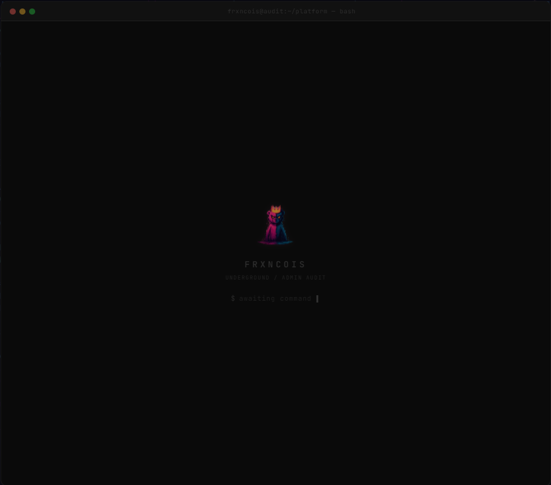
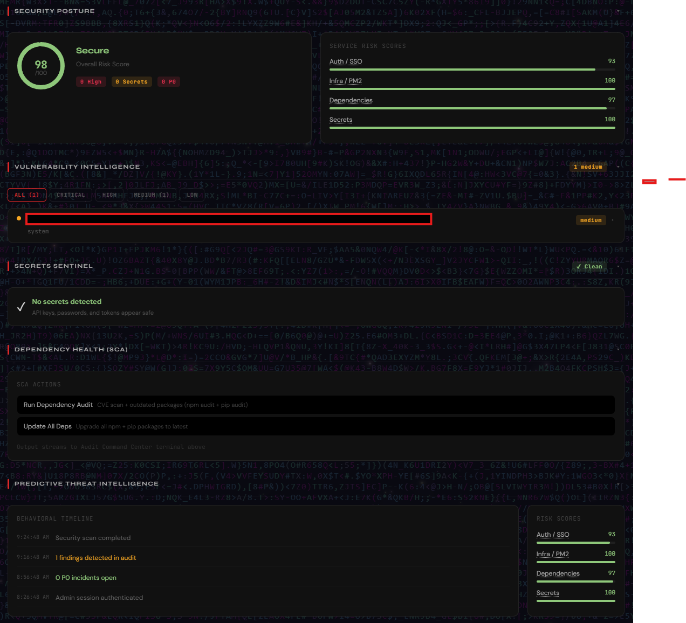
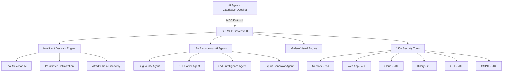

<div align="center">

> **Zero-Trust IP Allowlisting** — All admin operations (scans, audits, infra controls) are locked behind IP allowlisting. Even with valid credentials, requests must originate from the home network. VPN, proxy, and foreign IPs are rejected. IPv6 prefix matching requires a minimum /64 specificity to prevent broad-prefix bypass.

# SIC — Security Intelligence Center

### AI-Powered Pentesting MCP Framework for Authorized Security Testing

[](https://www.python.org/)
[](LICENSE)
[](#ai-client-integration)
[](#)
[](#security-tools-arsenal)
[](#ai-agents)

**An AI-powered pentesting MCP framework with 150+ security tools and 12+ autonomous agents for authorized security testing, CTF challenges, and defensive research.**

[SIC Engine](#sic-engine) | [Installation](#installation) | [API Reference](#api-reference)

</div>

---

## Overview

SIC is an AI-powered penetration testing framework that runs as a local server, exposing a comprehensive API and MCP interface for integration with AI clients (Claude, GPT, Copilot, Cursor, etc.).

---

## Previews

<div align="center">


</div>

---

## Architecture

SIC runs 150+ real offensive security tools (nmap, sqlmap, nuclei, hydra, etc.) — fully sandboxed in a hardened Docker container with multiple security layers.

### How It Works

```
AI Client (Claude, GPT, Copilot, Cursor)
  │
  ▼ (MCP Protocol)
SIC MCP Server
  │  ├─ Intelligent decision engine
  │  ├─ Tool selection & parameter optimization
  │  └─ Attack chain discovery
  │
  ▼
127.0.0.1:9888 (loopback only — never exposed)
  │
  ▼
Docker Container (sic-scanner)
  │  ├─ Scope enforcer (ALLOWED_TARGETS whitelist)
  │  ├─ Dry-run gate (on by default)
  │  └─ Tool execution (150+ tools)
  │
  ▼
./output/ (results only — source baked into image)
```

### Container Isolation

The Docker container enforces 12 security controls:

| Control | Setting | Purpose |
|---------|---------|---------|
| Port binding | `127.0.0.1:9888` | Never reachable from network |
| User | `scanner` (uid 1001) | Non-root, no privilege escalation |
| Capabilities | `cap_drop: ALL` | Zero Linux capabilities |
| Privilege escalation | `no-new-privileges: true` | Blocks setuid/setgid |
| CPU limit | 2 cores | Prevents self-DoS |
| Memory limit | 2 GB | Bounded resource usage |
| DNS | `127.0.0.1` only | Blocks external hostname resolution |
| Network | `scanner-net` bridge (internal on Linux) | No cross-container routes |
| Scanner mode | `SCANNER_MODE=sandbox` | Restricts target scope at app layer |
| Allowed targets | `target.example.com,192.168.1.0/24` | Whitelist-only scanning |
| Request budget | `MAX_REQUESTS_PER_SCAN=500` | Prevents runaway scans |
| Dry-run default | `DRY_RUN_DEFAULT=true` | Must explicitly opt into live scans |
| Scan timeout | `300s` hard wall | Kills scans after 5 minutes |
| Volume mounts | `./output` only | Source code baked into image, never mounted |

### Multi-Stage Build

The Dockerfile uses 3 stages to keep the image lean and the build fast:

| Stage | Base | What It Builds |
|-------|------|---------------|
| `go-builder` | `golang:1.24-alpine` | 13 Go tools (ffuf, gobuster, nuclei, httpx, subfinder, katana, etc.) |
| `py-builder` | `python:3.12-slim` | 30+ Python packages (sqlmap, dirsearch, theHarvester, pwntools, etc.) |
| `runtime` | `python:3.12-slim` | Final image — all tools + HexStrike API server |

Heavy packages (angr, autorecon, spiderfoot) are stubbed — the System Tab runs `which <tool>` to show availability, so stubs satisfy that without the OOM risk.

### Running It

```bash
# Start the sandboxed container
cd docker/sic-scanner
docker compose up -d

# Verify health
curl http://127.0.0.1:9888/health

# Register with PM2 (optional)
pm2 start "docker compose -f docker/sic-scanner/docker-compose.yml up" --name sic-scanner
```

---

## SIC Engine

AI-powered penetration testing framework with MCP protocol support. Connects to Claude, GPT, Copilot, Cursor, or any MCP-compatible AI client.

### Architecture



### How It Works

1. AI client sends commands via MCP protocol
2. Decision engine selects optimal tools and parameters
3. Security tools execute scans, exploits, and analysis
4. Results formatted and returned through MCP with visual output

### AI Agents

| Agent | Capability |
|-------|-----------|
| **BugBounty Agent** | Automated bug bounty hunting workflow |
| **CTF Solver Agent** | Challenge analysis and solution strategies |
| **CVE Intelligence Agent** | CVE lookup, exploitability analysis, patch tracking |
| **Exploit Generator Agent** | Proof-of-concept exploit development |
| **Recon Agent** | Automated reconnaissance and asset discovery |
| **Web Scanner Agent** | Comprehensive web application assessment |
| **Cloud Auditor Agent** | Multi-cloud security posture review |
| **Network Agent** | Internal/external network penetration testing |
| **Forensics Agent** | Digital forensics and incident response |
| **OSINT Agent** | Open-source intelligence gathering |
| **Social Engineering Agent** | Phishing simulation and awareness |
| **Report Generator Agent** | Automated pentest report creation |

### Security Tools Arsenal

<details>
<summary><strong>Network Security (25+ tools)</strong></summary>

nmap, masscan, rustscan, netcat, tcpdump, wireshark-cli, arp-scan, ping sweep, traceroute, DNS zone transfer, subdomain enumeration, and more.
</details>

<details>
<summary><strong>Web Application Security (40+ tools)</strong></summary>

sqlmap, nikto, wfuzz, gobuster, feroxbuster, httpx, nuclei, XSS detection, SSRF scanner, CORS checker, directory brute-forcing, and more.
</details>

<details>
<summary><strong>Cloud Security (20+ tools)</strong></summary>

ScoutSuite, Prowler, CloudSploit, S3 bucket scanner, IAM analyzer, container security scanning, and more.
</details>

<details>
<summary><strong>Binary Analysis (25+ tools)</strong></summary>

GDB, Radare2, Ghidra, Binwalk, checksec, ROPgadget, pwntools, and more.
</details>

<details>
<summary><strong>CTF Tools (20+ tools)</strong></summary>

CyberChef, John the Ripper, Hashcat, Stegsolve, memory/disk forensics toolkit, and more.
</details>

<details>
<summary><strong>OSINT (20+ tools)</strong></summary>

theHarvester, Shodan, SpiderFoot, Recon-ng, Maltego, and more.
</details>

### Advanced Capabilities

- **Intelligent Decision Engine** — AI-driven tool selection based on target context
- **Parameter Optimization** — Automatic tuning per tool/target combination
- **Attack Chain Discovery** — Links vulnerabilities into exploitable chains
- **Smart Caching** — Avoids redundant scans, caches intermediate results
- **Resource Management** — CPU/memory-aware scheduling
- **Error Recovery** — Automatic retry with fallback strategies

---

## Installation

### SIC Engine

```bash
git clone https://github.com/DevCraftXCoder/sic.git
cd sic
pip install -r requirements.txt
python sic_launcher.py
```

Default: `http://127.0.0.1:5000`

```bash
# Verify
curl http://127.0.0.1:5000/health

# Debug mode
python sic_launcher.py --debug

# Custom port
python sic_launcher.py --port 5001

# Register with PM2
pm2 start sic_launcher.py --name sic-server --interpreter python
```

### AI Client Integration

**Claude Desktop / Cursor:**
```json
{
  "mcpServers": {
    "sic": {
      "command": "python",
      "args": ["/path/to/sic/sic_mcp.py"]
    }
  }
}
```

**VS Code Copilot:**
```json
{
  "mcp.servers": {
    "sic": {
      "command": "python",
      "args": ["/path/to/sic/sic_mcp.py"]
    }
  }
}
```

---

## API Reference

### SIC Engine Endpoints

| Endpoint | Method | Description |
|----------|--------|-------------|
| `/health` | GET | Full system health + telemetry |
| `/api/tools` | GET | List all available tools |
| `/api/tools/<name>` | GET | Tool detail and status |
| `/api/scan` | POST | Run a targeted scan |
| `/api/agents` | GET | List AI agents |
| `/api/agents/<name>/run` | POST | Execute an agent task |
| `/api/processes` | GET | List running processes |
| `/api/processes/<id>` | DELETE | Kill a process |
| `/api/cache/clear` | POST | Clear scan cache |

### Common MCP Tools

```
# Network
sic_nmap_scan(target, flags)
sic_masscan(target, ports)
sic_port_scan(target)

# Web
sic_nikto_scan(target)
sic_sqlmap(target, params)
sic_directory_bruteforce(target, wordlist)

# Recon
sic_subdomain_enum(domain)
sic_whois(domain)
sic_dns_lookup(domain)

# Vulnerability
sic_nuclei_scan(target, templates)
sic_cve_lookup(cve_id)
sic_exploit_search(query)
```

---

## Security & Responsible Use

SIC is an **offensive security toolkit** for professionals. It generates real exploits, runs real scans, and can cause real damage if misused.

- All tools run locally — no telemetry, no data exfiltration
- API key auth protects the server
- Smart caching stores results locally — clear with `/api/cache/clear`
- Exploit generation and CVE research are first-class features

This is a private tool shared among trusted peers. If you have access, you already know the rules: **test only what you're authorized to test.**

---

## License

MIT License — see [LICENSE](LICENSE) for details.
