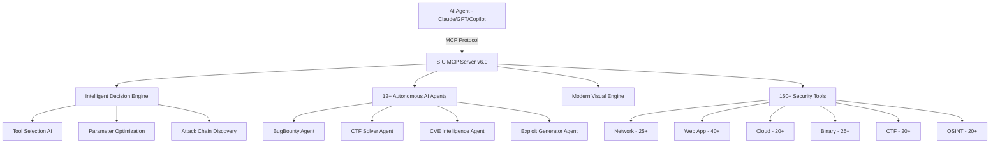

<div align="center">

# SIC — Security Intelligence Center

### Private Offensive Security + Admin Operations Platform

[](https://www.python.org/)
[](LICENSE)
[](#ai-client-integration)
[](#)
[](#security-tools-arsenal)
[](#ai-agents)

**Two systems in one repo: an AI-powered pentesting MCP framework (150+ tools, 12+ agents) and a full admin operations dashboard for platform monitoring, user management, infrastructure control, and observability.**

[SIC Engine](#sic-engine) | [Admin System Tab](#admin-system-tab) | [Installation](#installation) | [API Reference](#api-reference)

</div>

---

## Overview

SIC is split into two layers:

| Layer | What It Does | Stack |
|-------|-------------|-------|
| **SIC Engine** | Offensive security automation — scans, exploits, recon, CTF solving, CVE intelligence | Python + Flask + MCP |
| **Admin System Tab** | Platform operations dashboard — health monitoring, user management, error logs, infra controls, observability | Next.js 15 + React (admin panel) |

The SIC Engine runs as a local server. The Admin System Tab is a section of the MizzyTools admin dashboard that ties into the engine and also manages all platform infrastructure independently.

---

## Sandbox Architecture

SIC runs 126 real offensive security tools (nmap, sqlmap, nuclei, hydra, etc.) — so it's fully sandboxed in a hardened Docker container. The admin dashboard never talks to the engine directly; everything goes through an authenticated API proxy.

### How It Works

```
Browser (Admin Dashboard)
  │
  ▼
Next.js API Proxy (/api/admin/systems/sic)
  │  ├─ CORS check (x-requested-with header)
  │  ├─ IP allowlist (home network only)
  │  └─ Session auth (admin_auth cookie + ADMIN_PASSWORD)
  │
  ▼
127.0.0.1:9888 (loopback only — never exposed)
  │
  ▼
Docker Container (sic-scanner)
  │  ├─ Scope enforcer (ALLOWED_TARGETS whitelist)
  │  ├─ Dry-run gate (on by default)
  │  └─ Tool execution (126 tools)
  │
  ▼
./output/ (results only — source baked into image)
```

### Container Isolation

The Docker container enforces 12 security controls:

| Control | Setting | Purpose |
|---------|---------|---------|
| Port binding | `127.0.0.1:9888` | Never reachable from network |
| User | `scanner` (uid 1001) | Non-root, no privilege escalation |
| Capabilities | `cap_drop: ALL` | Zero Linux capabilities |
| Privilege escalation | `no-new-privileges: true` | Blocks setuid/setgid |
| CPU limit | 2 cores | Prevents self-DoS |
| Memory limit | 2 GB | Bounded resource usage |
| DNS | `127.0.0.1` only | Blocks external hostname resolution |
| Network | `scanner-net` bridge (internal on Linux) | No cross-container routes |
| Scanner mode | `SCANNER_MODE=sandbox` | Restricts target scope at app layer |
| Allowed targets | `staging.frxncois.com,127.0.0.1:9003` | Whitelist-only scanning |
| Request budget | `MAX_REQUESTS_PER_SCAN=500` | Prevents runaway scans |
| Dry-run default | `DRY_RUN_DEFAULT=true` | Must explicitly opt into live scans |
| Scan timeout | `300s` hard wall | Kills scans after 5 minutes |
| Volume mounts | `./output` only | Source code baked into image, never mounted |

### Multi-Stage Build

The Dockerfile uses 3 stages to keep the image lean and the build fast:

| Stage | Base | What It Builds |
|-------|------|---------------|
| `go-builder` | `golang:1.24-alpine` | 13 Go tools (ffuf, gobuster, nuclei, httpx, subfinder, katana, etc.) |
| `py-builder` | `python:3.12-slim` | 30+ Python packages (sqlmap, dirsearch, theHarvester, pwntools, etc.) |
| `runtime` | `python:3.12-slim` | Final image — all tools + HexStrike API server |

Heavy packages (angr, autorecon, spiderfoot) are stubbed — the System Tab runs `which <tool>` to show availability, so stubs satisfy that without the OOM risk.

### API Proxy (3-Layer Auth)

The admin dashboard proxies all SIC requests through `Next.js → /api/admin/systems/sic`. Three checks must pass:

1. **CORS** — `x-requested-with: XMLHttpRequest` header required
2. **IP allowlist** — request must come from the home network (`isAllowedIP()`)
3. **Session auth** — valid `admin_auth` cookie verified against `ADMIN_PASSWORD`

GET requests timeout at 10s (health checks). POST requests timeout at 60s (scan operations).

On cloud deployments (no `SIC_SERVER_URL` or `SIC_LOCAL_MODE` set), the proxy returns `503 — local_only: true` and the SICPanel shows a banner instead of attempting to reach localhost.

### Running It

```bash
# Start the sandboxed container
cd docker/sic-scanner
docker compose up -d

# Verify health
curl http://127.0.0.1:9888/health

# View in admin dashboard
# Navigate to MizzyTools → System Tab → SIC Panel

# Register with PM2 (optional)
pm2 start "docker compose -f docker/sic-scanner/docker-compose.yml up" --name sic-scanner
```

---

## SIC Engine

AI-powered penetration testing framework with MCP protocol support. Connects to Claude, GPT, Copilot, Cursor, or any MCP-compatible AI client.

### Architecture



### How It Works

1. AI client sends commands via MCP protocol
2. Decision engine selects optimal tools and parameters
3. Security tools execute scans, exploits, and analysis
4. Results formatted and returned through MCP with visual output

### AI Agents

| Agent | Capability |
|-------|-----------|
| **BugBounty Agent** | Automated bug bounty hunting workflow |
| **CTF Solver Agent** | Challenge analysis and solution strategies |
| **CVE Intelligence Agent** | CVE lookup, exploitability analysis, patch tracking |
| **Exploit Generator Agent** | Proof-of-concept exploit development |
| **Recon Agent** | Automated reconnaissance and asset discovery |
| **Web Scanner Agent** | Comprehensive web application assessment |
| **Cloud Auditor Agent** | Multi-cloud security posture review |
| **Network Agent** | Internal/external network penetration testing |
| **Forensics Agent** | Digital forensics and incident response |
| **OSINT Agent** | Open-source intelligence gathering |
| **Social Engineering Agent** | Phishing simulation and awareness |
| **Report Generator Agent** | Automated pentest report creation |

### Security Tools Arsenal

<details>
<summary><strong>Network Security (25+ tools)</strong></summary>

nmap, masscan, rustscan, netcat, tcpdump, wireshark-cli, arp-scan, ping sweep, traceroute, DNS zone transfer, subdomain enumeration, and more.
</details>

<details>
<summary><strong>Web Application Security (40+ tools)</strong></summary>

sqlmap, nikto, wfuzz, gobuster, feroxbuster, httpx, nuclei, XSS detection, SSRF scanner, CORS checker, directory brute-forcing, and more.
</details>

<details>
<summary><strong>Cloud Security (20+ tools)</strong></summary>

ScoutSuite, Prowler, CloudSploit, S3 bucket scanner, IAM analyzer, container security scanning, and more.
</details>

<details>
<summary><strong>Binary Analysis (25+ tools)</strong></summary>

GDB, Radare2, Ghidra, Binwalk, checksec, ROPgadget, pwntools, and more.
</details>

<details>
<summary><strong>CTF Tools (20+ tools)</strong></summary>

CyberChef, John the Ripper, Hashcat, Stegsolve, memory/disk forensics toolkit, and more.
</details>

<details>
<summary><strong>OSINT (20+ tools)</strong></summary>

theHarvester, Shodan, SpiderFoot, Recon-ng, Maltego, and more.
</details>

### Advanced Capabilities

- **Intelligent Decision Engine** — AI-driven tool selection based on target context
- **Parameter Optimization** — Automatic tuning per tool/target combination
- **Attack Chain Discovery** — Links vulnerabilities into exploitable chains
- **Smart Caching** — Avoids redundant scans, caches intermediate results
- **Resource Management** — CPU/memory-aware scheduling
- **Error Recovery** — Automatic retry with fallback strategies

---

## Admin System Tab

The System tab is the operations center inside the MizzyTools admin dashboard. Eight collapsible sections, each lazy-loaded for performance. All data auto-refreshes on 30-60s intervals.

### Section Map

| # | Section | Component | What It Shows |
|---|---------|-----------|---------------|
| 1 | **Overview** | `SystemOverviewCards` | 8 stat cards — total users, active users (30d), total tracks, published tracks, total posts, total comments, platform revenue MTD, Underground+ subscribers. Auto-refreshes every 60s. |
| 2 | **Observability** | `ObservabilityPanel` | Prometheus metrics (SSO req/s, p95 latency, auth failures/s, WS connections, host CPU %, host memory %, container restarts/1h) + Kafka consumer lag table with per-group/topic breakdown and HIGH LAG warnings. |
| 3 | **User Management** | `UserManagementTable` | Full user table — display name, handle, avatar, subscription tier (Free/Basic/Pro/Underground+), verified badge, ban status, soft-delete status, join date. Actions: ban, verify, delete. Search + filter. |
| 4 | **Content Moderation** | `ContentReportsPanel` | Report queue with target type (track/post/profile/comment), reporter info, reason, AI auto-research results, status (pending/under_review/resolved/dismissed). Actions: dismiss, warn, remove content, escalate. |
| 5 | **Service Health** | `ServiceHealthGrid` | Live health status for 6 services — Underground API, SSO, Stats Server, Email Saver, Cobalt API, Memory MCP. Status dots (healthy/degraded/down/unknown), latency in ms, relative last-check time. 7-day uptime percentages with progress bars. |
| 6 | **Error Logs** | `ErrorLogTable` | D1 error log viewer with filters — time range (1h/24h/7d/30d), status code (4xx/5xx), HTTP method, path search. Color-coded methods and status codes, expandable rows, aggregate strip (total/4xx/5xx counts). |
| 7 | **Announcements** | `AnnouncementsManager` | CRUD for platform announcements — types (info/warning/maintenance/release), active toggle, dismissible flag, optional expiration, dismiss count tracking. Create, edit, delete. |
| 8 | **Infrastructure** | `InfrastructurePanel` | Deploy status (Vercel + GitHub Actions), environment audit (env var presence check per feature, SET/MISSING indicators), process controls (restart stats-server, docker cleanup with confirmation + reason), SSO stats (registered clients, active tokens, auth attempts/failures/rate limit hits in 24h). |

### SIC Panel (Security Layer)

The `SICPanel` component connects to the SIC engine via `/api/admin/systems/sic` proxy and adds:

- **Server Health** — version, uptime, total tools available vs total count
- **Tool Status** — per-tool availability with green/red indicators
- **Category Stats** — tools available per category (network, web, cloud, binary, CTF, OSINT)
- **Telemetry** — commands executed, success rate, average execution time
- **System Metrics** — CPU %, memory %, disk usage
- **Smart Scan** — trigger targeted scans (network, web, full, recon, vuln) directly from the admin panel with real-time results

When the SIC server is offline, the panel shows a banner with the startup command: `pm2 start sic-server`.

### Design System

All admin panels follow the same visual language:

| Token | Value |
|-------|-------|
| Background | `#0a0a0a` (page), `#111` (elevated panels), `#181818` (cards) |
| Accent | `#e94560` (red) |
| Success | `#22c55e` |
| Warning | `#f59e0b` |
| Info | `#3b82f6` |
| Fonts | Syne (headings), DM Sans (body), JetBrains Mono (code/paths) |
| Borders | `rgba(255,255,255,0.06)` default |

### Data Sources

| Panel | API Endpoint | Source |
|-------|-------------|--------|
| Overview | `/api/admin/underground-stats`, `/api/admin/underground-stats-rich` | Underground API (D1) |
| Observability | `/api/admin/prometheus`, `/api/admin/kafka-lag` | Prometheus, Kafka UI |
| Users | `/api/admin/underground-users` | Underground API (D1) |
| Moderation | `/api/admin/underground-reports` | Underground API (D1) |
| Health | `/api/admin/underground-health`, `/api/admin/sso-health`, `/api/admin/underground-uptime` | Direct health checks + D1 uptime_checks |
| Errors | `/api/admin/underground-errors` | Underground API (D1 error_logs, 30-day TTL) |
| Announcements | `/api/admin/underground-announcements` | Underground API (D1) |
| Infrastructure | `/api/admin/deploy-status`, `/api/admin/gh-deploy-status`, `/api/admin/env-check`, `/api/admin/sso-stats`, `/api/admin/restart-stats`, `/api/admin/docker-cleanup` | Vercel API, GitHub API, local PM2/Docker |
| SIC | `/api/admin/systems/sic` | SIC Engine (Flask, port 5000) |

---

## Installation

### SIC Engine

```bash
git clone https://github.com/DevCraftXCoder/sic.git
cd sic
pip install -r requirements.txt
python sic_launcher.py
```

Default: `http://127.0.0.1:5000`

```bash
# Verify
curl http://127.0.0.1:5000/health

# Debug mode
python sic_launcher.py --debug

# Custom port
python sic_launcher.py --port 5001

# Register with PM2
pm2 start sic_launcher.py --name sic-server --interpreter python
```

### AI Client Integration

**Claude Desktop / Cursor:**
```json
{
  "mcpServers": {
    "sic": {
      "command": "python",
      "args": ["/path/to/sic/sic_mcp.py"]
    }
  }
}
```

**VS Code Copilot:**
```json
{
  "mcp.servers": {
    "sic": {
      "command": "python",
      "args": ["/path/to/sic/sic_mcp.py"]
    }
  }
}
```

---

## API Reference

### SIC Engine Endpoints

| Endpoint | Method | Description |
|----------|--------|-------------|
| `/health` | GET | Full system health + telemetry |
| `/api/tools` | GET | List all available tools |
| `/api/tools/<name>` | GET | Tool detail and status |
| `/api/scan` | POST | Run a targeted scan |
| `/api/agents` | GET | List AI agents |
| `/api/agents/<name>/run` | POST | Execute an agent task |
| `/api/processes` | GET | List running processes |
| `/api/processes/<id>` | DELETE | Kill a process |
| `/api/cache/clear` | POST | Clear scan cache |

### Common MCP Tools

```
# Network
sic_nmap_scan(target, flags)
sic_masscan(target, ports)
sic_port_scan(target)

# Web
sic_nikto_scan(target)
sic_sqlmap(target, params)
sic_directory_bruteforce(target, wordlist)

# Recon
sic_subdomain_enum(domain)
sic_whois(domain)
sic_dns_lookup(domain)

# Vulnerability
sic_nuclei_scan(target, templates)
sic_cve_lookup(cve_id)
sic_exploit_search(query)
```

---

## Security & Responsible Use

SIC is an **offensive security toolkit** for professionals. It generates real exploits, runs real scans, and can cause real damage if misused.

- All tools run locally — no telemetry, no data exfiltration
- API key auth protects the server
- Smart caching stores results locally — clear with `/api/cache/clear`
- Exploit generation and CVE research are first-class features

This is a private tool shared among trusted peers. If you have access, you already know the rules: **test only what you're authorized to test.**

---

## License

MIT License — see [LICENSE](LICENSE) for details.
